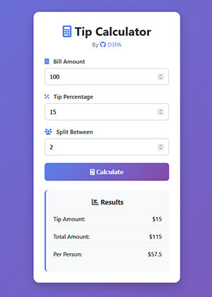

# Tip Calculator Web App

Simple Flask web application for calculating tips and splitting bills.

## Features
- Calculate tip amounts and total bills
- Split bills between multiple people
- Responsive and modern design
- Real-time calculations without page reload

## Installation & Usage

1. **Install dependencies**:
   
```bash
pip install -r requirements.txt
```
   
2. **Run the application**:

```bash
python app.py
```

3. **Open your browser and visit**:

```bash
http://localhost:5000
```

## Sample Output


## Requirements

- Python 3.x
- Flask 2.3.3

